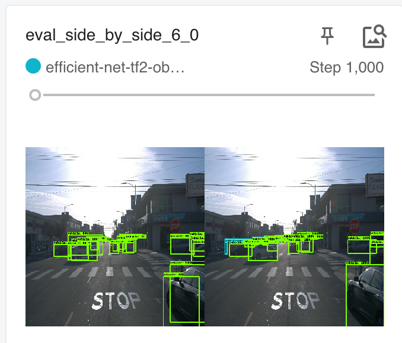
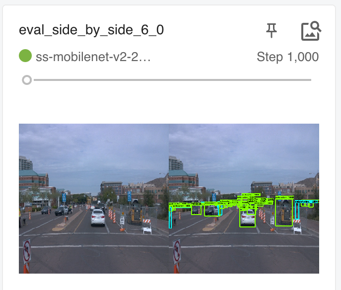
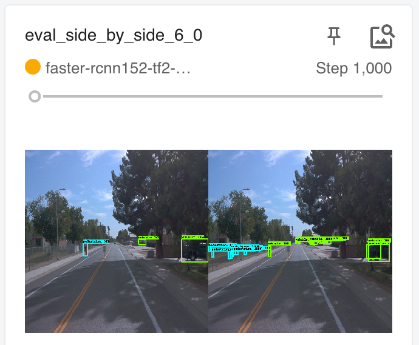

# Object Detection in Urban Environment
 
## Table Of Contents
- [Object Detection in Urban Environment](#object-detection-in-urban-environment)
  - [Table Of Contents](#table-of-contents)
  - [Introduction](#introduction)
  - [Dataset](#dataset)
  - [Methodology](#methodology)
    - [Training \& Deployment Process with AWS](#training--deployment-process-with-aws)
    - [Model Selection](#model-selection)
    - [Results](#results)
  - [Future Work \& Possible Improvement](#future-work--possible-improvement)

## Introduction
Utilizing transfer learning using TensorFlow object detection API and AWS Sagemaker to train models to detect and classify objects using data from the Waymo Open Dataset.

## Dataset
Front Camera Images from [Waymo Open Dataset](https://waymo.com/open/). 
Data are in **TFRecord** Format, the TFRecord format is a simple format for storing a sequence of binary records, which helps in data reading and processing efficiency.

## Methodology 
### Training & Deployment Process with AWS
- AWS Sagemaker for running Jupyter notebooks, training and deploying the model, and inference.
- AWS Elastic Container Registry (ECR) to build the Docker image and create the container required for running this project.
- AWS Simple Storage Service (S3) to save logs for creating visualizations. Also, the data for this project was stored in a public S3 bucket.

### Model Selection
For this project, I tested several object detection models using the Tensorflow Object Detection API. The models tested were:

|         **Model**        	|  **Config**  	|
|:------------------------:	|:------------:	|
| EfficientNet D1          	| [file](1.efficient_net\pipeline_efficient.config) 	|
| SSD MobileNet V2 FPNLite 	| [file](3.ssd_mobinet_v2\ssd_mobilenet_v2_fpn.config) 	|
| Faster RCNN Resnet152 FPN       | [file](2.faster_rcnn152\Faster_R_CNN_ResNet152_pipeline.config) 	|

These pre-trained models are available in the TensorFlow 2 Object Detection Model Zoo, and they were trained on the COCO 2017 dataset. 
So,  their `pipeline.config` files need to be adjusted so TensorFlow 2 can find the `TFRecord` and `label_map.pbtxt` files when they are loaded inside the container from Amazon S3.
 
Since the Waymo dataset has only 3 classes, Cars, Pedestrians, and Cyclists, the `pipeline.config` was adjusted to our problem instead of the 90 classes that were there for the COCO dataset.

For the 3 Models I used a fixed number of training steps which is **1000**, this was due to my limited AWS budget.

Also, I used Momentum Optimizer with the same batch size of **8** in the 3 experiments, for the same reason.

### Results
Each model was evaluated using the mAP metric, which measures the accuracy of the model in detecting objects. The mAP is calculated based on the precision and recall of the model at different IoU (Intersection over Union) thresholds.

Tensorboard was used to visualize the training loss and validation mAP for each model. From the Tensorboard graphs, we observed that the models showed similar patterns in terms of training loss, but differed in their ability to generalize to the test data.

|                                       	|                        EfficientNet D1                       	|                 SSD MobileNet V2 FPNLite               	|                   Faster RCNN Resnet152 FPN                 	|
|:-------------------------------------:	|:------------------------------------------------------------:	|:------------------------------------------------------:	|:-----------------------------------------------------:	|
|             **mAP@.50IOU**            	|                             0.1722                        |                          0.1631                        	|                         **0.2418**                        	|
|             **mAP@.75IOU**            	|                             0.02105                           	|                          0.05872                        |                         **0.09426**                 	|
|        **mAP (small objects)**        	|                            0.02203                           	|                          **0.02228**                       |                         N/A                       	|
|        **mAP (medium objects)**       	|                             0.233                         |                          0.2596                        	|                         **384**                        	|
|        **mAP (large objects)**        	|                             0.2336                         |                          **0.2675**                        	|                         N/A                        	|
| **Predicted Vs Ground Truth Sample** 	|         	|         	|         	|
|               **Video**               	|                          	|                       	|                       	|

Based on the results of the three models evaluated for object detection in an urban environment, the Faster RCNN Resnet152 FPN model performed the best with an mAP@(0.5 & 0.75) IOU, outperforming both the EfficientNet D1 and SSD MobileNet V2 FPNLite models.

In terms of detecting small and large objects like cyclists and pedestrians, the SSD MobileNet V2 FPNLite had the highest mAP, indicating its ability to detect smaller objects better than the other models.
The three models had poor performance in detecting cyclists. This may be a result due to the skewness of the dataset, where cars are the dominant class in the dataset, and the cyclists class is the least abundant.

Overall, the model selection process showed that different models have different strengths and weaknesses in object detection, and choosing the right model for a specific application requires careful consideration of the type and size of the objects to be detected. Additionally, the results suggest that the EfficientNet D1 model may not be the best choice for object detection in an urban environment, at least not without further optimization and tuning.

Here are the training losses of the 3 experiments:

The plots show that the 3 models could achieve better loss if we increased the n. of training steps because there is room for convergence.

## Future Work & Possible Improvement

We identified several potential avenues for improving performance, but they would require additional resources and a higher computing budget. These include:
- Increase the training steps: Each model was trained for only 1000 steps, which is relatively low for such kinds of data and complex architectures. So, increasing the number of training steps till the loss reaches the plateau can further improve performance.
- Data augmentation: techniques such as flipping, scaling, and random cropping. More advanced techniques such as color jittering, rotation, and translation can also be used to improve the model's accuracy.
- Hyperparameter tuning: Fine-tuning the hyperparameters can potentially improve the model's performance.
- Handling occlusion and partial object detection: In this project, we focused on detecting complete objects. However, in an urban environment, objects are often partially occluded or obstructed. Developing techniques to handle partial object detection can further improve the model's performance.
